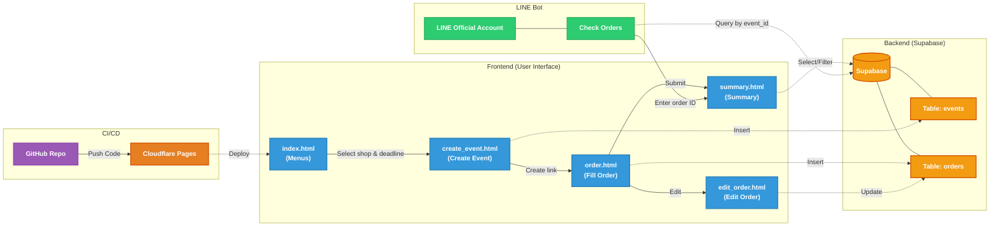

# [Ordersystem](https://ordersystem-46n.pages.dev/)

整合部分手搖飲連鎖店及餐廳菜單，讓大家可以在同一個地方瀏覽多家店家的菜單，並統一建立與管理訂單。

---

## 功能

- 瀏覽多家手搖飲店的菜單
- 建立訂餐活動並產生專屬連結
- 填寫、修改個人訂單
- 查看所有人的訂單彙整

---

## 使用流程

1. 進入網站，選擇要訂的店家
2. 建立訂餐活動，設定截止時間，取得訂單連結
3. 將連結分享給大家填單
4. 截止後查看訂單總覽

> 也可以透過 **LINE Bot** 輸入活動 ID 來查詢訂單總覽。

---

## 技術

| 類別 | 技術 |
|:------:|:------:|
| 前端 | HTML / CSS / JavaScript |
| 建置工具 | Vite |
| 後端 | Supabase |
| LINE Bot | LINE Messaging API |
| CI/CD | GitHub Actions |
| 部署 | GitHub Pages |


---

## 系統架構



---

## 本地開發

```bash
git clone https://github.com/Tseng1114/Ordersystem.git
cd Ordersystem
npm install
npm run dev
```

在 `.env` 填入 Supabase 相關設定：

```env
VITE_SUPABASE_URL=your_supabase_url
VITE_SUPABASE_ANON_KEY=your_supabase_anon_key
```
